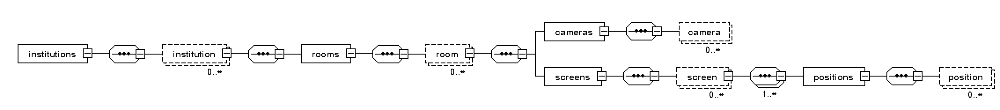

.. image:: https://circleci.com/gh/video699/implementation-screens/tree/master.svg?style=shield
    :target: https://circleci.com/gh/video699/implementation-screens/tree/master

This is a XML dataset that describes the *projection screens* and *camcoders*
installed in *rooms* belonging to an *institution*.

The XML schema ``schema.xsd`` describes the structure of the dataset.  The
`linked presentation
<https://github.com/video699/implementation-report/releases/download/2018/11/26/beamer.pdf>`_
outlines the `system <https://github.com/video699/implementation-system>`_ for
which the dataset was built. The directory ``example`` contains a configuration
for an example institution.
